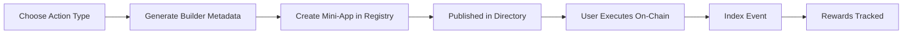

The Action Kit lets you build and deploy **mini-apps**: on-chain actions (swaps, transfers, bridges) that can be embedded directly inside social platforms. Users discover mini-apps through the directory, execute them in-context, and earn rewards. Operators register mini-apps, configure actions via builders, and track engagement through indexing and rewards endpoints.

## Core Concepts

### Mini-Apps

A mini-app is an on-chain action packaged with metadata so it can be rendered and executed in any social context. Each mini-app has:

- A **type** — `swap`, `onboarding`, etc.
- **Metadata** — the action definition (chains, tokens, amounts, UI config)
- A **registry entry** — your operator's record for the mini-app

Mini-apps are created via `POST /v1/action` and their metadata is generated using the Action Builders.

### Action Builders

Action Builders generate the structured metadata that defines what a mini-app does. Instead of constructing raw JSON, you call a builder endpoint with high-level parameters:

| Builder | Endpoint | Purpose |
|---------|----------|---------|
| Swap | `POST /v1/action/builders/swap` | Token swap on a single chain |
| Staking | `POST /v1/action/builders/staking` | Stake tokens in a protocol |
| Crosschain Transfer | `POST /v1/action/builders/crosschain-transfer` | Send tokens across chains |
| Native Transfer | `POST /v1/action/builders/transfer-native` | Send native tokens (ETH, MATIC) |
| Crosschain Bridge | `POST /v1/action/builders/crosschain-bridge` | Bridge assets between networks |

The builder returns a metadata object you store when creating or updating a mini-app.

### Token Management

The tokens endpoint provides the supported token list for any chain and protocol combination. Use this to populate token selectors in your mini-app UI before calling a builder.

```
GET /v1/action/tokens/:chain/:protocol
```

Example: `GET /v1/action/tokens/polygon/uniswap` returns all Uniswap tokens on Polygon.

### Directory

The directory is a public listing of all published mini-apps across operators. Embedders query the directory to discover available actions for their platform.

```
GET /v1/action/directory
```

No authentication required for directory reads.

### Indexing

When a user executes a mini-app, your platform reports the on-chain event to Relayer via the indexing endpoint. This powers rewards tracking and analytics.

```
POST /v1/action/indexing/events
```

### Rewards & Referrals

The rewards system tracks KOL (Key Opinion Leader) performance metrics: which mini-apps they've shared, how many on-chain executions resulted from their referrals, and aggregated volume. Metrics are queryable by wallet address.

```
GET /v1/action/rewards/metrics?address=0xYourAddress
GET /v1/action/rewards/mini-apps-with-onchain-metrics?address=0xYourAddress
```

## Mini-App Lifecycle



1. **Design** — Choose an action type and get token list for your chain + protocol
2. **Build** — Call a builder to generate the action metadata
3. **Register** — Create the mini-app in the registry with the builder metadata
4. **Discover** — Mini-app appears in the directory for embedders
5. **Execute** — Users interact with the mini-app on social platforms
6. **Track** — Index on-chain events; query rewards metrics for KOLs

## Endpoint Summary

| Group | Prefix | Purpose |
|-------|--------|---------|
| Registry | `/v1/action` | Create and manage mini-apps |
| Builders | `/v1/action/builders` | Generate action metadata |
| Directory | `/v1/action/directory` | Public mini-app discovery |
| Tokens | `/v1/action/tokens` | Supported token lists |
| Indexing | `/v1/action/indexing` | Report on-chain execution events |
| Rewards | `/v1/action/rewards` | KOL metrics and referral tracking |

## Next Steps

<CardGroup cols={2}>
  <Card title="Flow Guide" icon="route" href="/action/flow-guide">
    Build and deploy a mini-app step by step.
  </Card>
  <Card title="Endpoints" icon="code" href="/action/endpoints">
    Full reference for builders, registry, and rewards.
  </Card>
</CardGroup>
