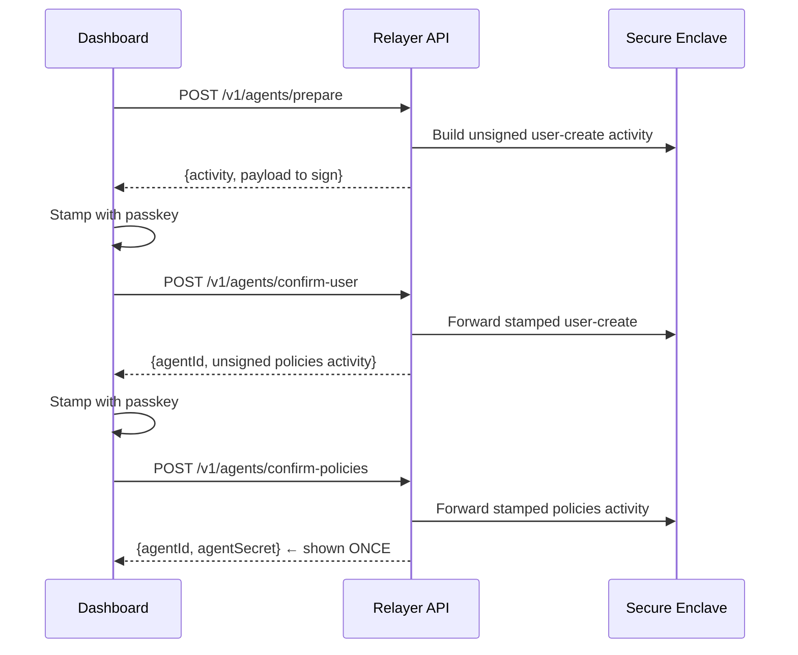

The Agent Kit lifecycle has four stages: **provision**, **fund**, **operate**, and **respond to approvals**. Every passkey-signed step uses prepare/confirm so private key material never leaves the secure enclave.

<Note>
  The **provision** and **fund** stages are passkey-stamped — today they run from the dashboard, which orchestrates the prepare/confirm rounds against the API endpoints shown below. The **operate** stage (runtime HMAC) is fully backend/SDK-driven.
</Note>

## 1. Provision an agent (3-round passkey flow)



If the flow is interrupted between rounds 2 and 3, the dashboard resumes via `POST /v1/agents/{id}/prepare-policies`. To abandon, call `DELETE /v1/agents/{id}` while status is `pending_policies`.

## 2. Fund the agent wallet

```text
POST /v1/agents/{id}/fund/prepare   { amountUSDC }
  → unsigned USDC transfer activity from integrator wallet → agent wallet
POST /v1/agents/{id}/fund/confirm   { stamped activity }
  → broadcasts the transfer
```

## 3. Configure budgets

```text
POST /v1/agents/{id}/budget {
  infrastructure: { monthlyUSD: 50 },
  tokens:         { monthlyUSD: 200 },
  payments:       { monthlyUSDC: 1000, perTxUSDC: 100, approvalThresholdUSDC: 50 }
}
```

Three layers are enforced independently:
- **infra** — every API call (cheap, frequent)
- **tokens** — every LLM token usage event
- **payments** — every USDC outflow

When the SDK is going to pay, it calls `checkPaymentBudget()` which queries all 3 + the kill switch. When emitting telemetry, it calls `checkBudget()` which queries layers 1+2 only (fail-open on layer 3).

## 4. Agent operates (HMAC X-Agent-Auth)

The agent SDK signs every request with `HMAC-SHA256(method + path + body, secret)`:

```ts
import { RelayerSDK } from "@relayerfi/agent-sdk";

const sdk = new RelayerSDK({
  agentId: process.env.RELAYER_AGENT_ID!,
  agentSecret: process.env.RELAYER_AGENT_SECRET!,
  apiUrl: "https://api.relayer.fi",
});

// Pay an x402-gated endpoint
const data = await sdk.x402fetch("https://paid-api.example.com/v1/run", {
  method: "POST",
  body: JSON.stringify({ input }),
});

// Sign a Solana transaction
const sig = await sdk.http.request("POST", `/agents/${sdk.agentId}/sign-transaction`, {
  unsignedTx: base64Tx,
});
```

## 5. Approvals (above threshold)

If a payment exceeds `approvalThresholdUSDC`, the API responds **HTTP 202** with `{ approvalId }`. The SDK suspends and polls `/v1/signing/approvals/{id}` every 5s until a CFO approves with passkey (or until the 5-minute deadline). A human approver in the dashboard sees the request in their queue (`GET /v1/signing/approvals?status=pending`) and stamps approval with `POST /v1/signing/approvals/{id}/approve-with-passkey`.

## 6. Emergency stop

```text
POST /v1/agents/{id}/kill      → irreversible. Wallet stays funded; further txs rejected.
POST /v1/agents/{id}/pause     → reversible. Use for routine maintenance.
POST /v1/agents/{id}/rotate    → issues a new secret. Old one revoked instantly.
```

The SDK polls `/v1/agents/{id}/status` every 30s. On `killed` or API unreachable, payment ops block (fail-safe); telemetry continues (fail-open).
