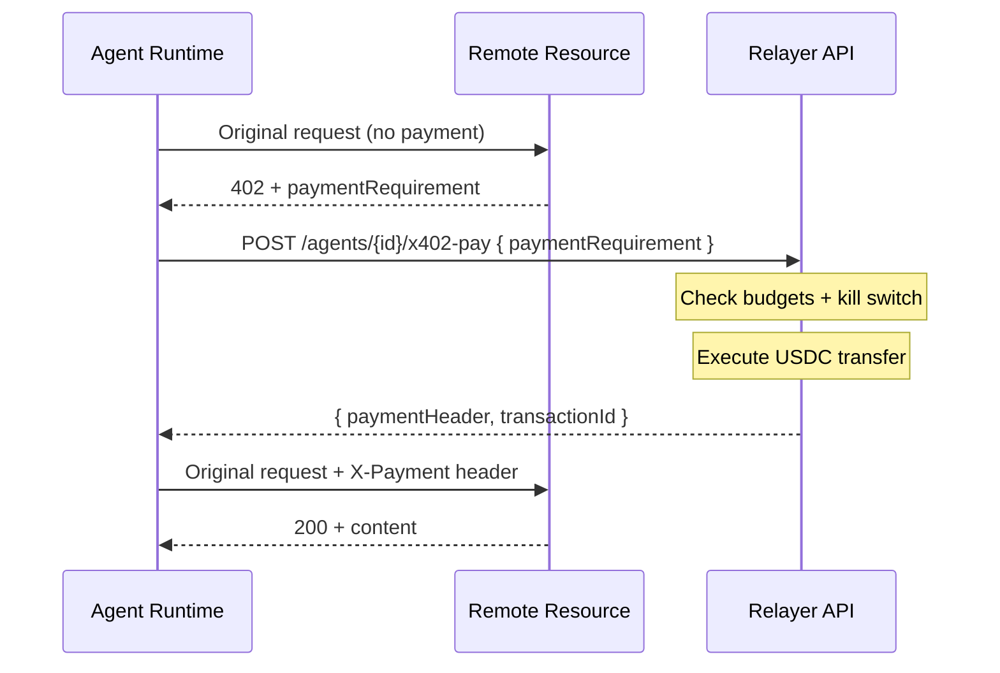

This is the **payment primitive** of the Agent Kit. The agent presents a payment requirement (received from a 402-responding service), the API validates against all 3 budget layers + the kill switch, executes the on-chain USDC transfer, and returns a payment header the agent can attach to retry the original request.

<Info>
  Most users should use the SDK's `x402fetch()` helper instead of calling this endpoint directly. `x402fetch` handles the full 402 → pay → retry loop transparently.
</Info>

## When to call this directly vs use `x402fetch`

| Use case | Recommended |
|---|---|
| Calling a third-party API that may return 402 | **`x402fetch`** — handles the loop for you |
| Building a custom client (non-Node.js, no SDK) | **This endpoint** — replicate the loop yourself |
| Paying for a resource without retrying (e.g. pre-paying for batch credit) | **This endpoint** — caller controls what to do with the payment header |
| Inspecting payment intent before executing | **This endpoint** — you can re-render the requirement to the user before submission |

## How the loop works (with `x402fetch`)



The whole loop is one `await x402fetch(sdk, url, init)` call in the SDK. This page covers what happens server-side during the middle step.

## Authentication

This endpoint accepts **either** auth mode:

- **HMAC** (`X-Agent-Auth` + `x-agent-id` + `x-request-timestamp`) — when called by the agent SDK at runtime. See [Authentication](/get-started/authentication) for the payload spec.
- **API key** (`Authorization: ApiKey ...`) — when called by your backend on behalf of the agent.

The `{id}` path param must match the calling agent (if HMAC) or be a valid agent in the API key's workspace (if API key).

## Request body

<ParamField body="paymentRequirement" type="object" required>
  The payment terms received in the 402 response from the resource. Schema below.
</ParamField>

The `paymentRequirement` object:

<ParamField body="paymentRequirement.amount" type="string" required>
  Decimal USDC amount as a string (e.g. `"0.05"`). String to avoid float precision issues.
</ParamField>

<ParamField body="paymentRequirement.currency" type="string" required>
  Always `"USDC"` in v1. Reserved for future expansion.
</ParamField>

<ParamField body="paymentRequirement.network" type="string" required>
  Stablecoin network. Today: `"solana"`. EVM chain support is planned.
</ParamField>

<ParamField body="paymentRequirement.recipient" type="string" required>
  The address that should receive the USDC. The API validates this matches the 402 response's intent and the skill's registered receiver (when paying a Relayer skill).
</ParamField>

<ParamField body="paymentRequirement.description" type="string">
  Optional human-readable description from the resource. Logged in the audit trail.
</ParamField>

<ParamField body="paymentRequirement.resource" type="string">
  Optional URL of the resource being paid for. Logged in the audit trail.
</ParamField>

## Response

<ResponseField name="paymentHeader" type="string">
  The opaque value to attach to your retry request as the `X-Payment` header. The resource will validate it and serve the protected content.
</ResponseField>

<ResponseField name="transactionId" type="string">
  Optional. Set if the payment resulted in an on-chain transaction (vs. a pre-funded credit pull). Use with chain explorers to confirm.
</ResponseField>

## What the API checks before executing

1. **Authenticates** the request (HMAC or API key).
2. **Looks up** the agent and validates it's not `killed` or `paused`.
3. **Polls** the kill switch state — refuses on active kill switch.
4. **Validates** all 3 budget layers atomically (Lua script in Redis):
   - `infra` — does the agent have infrastructure budget left?
   - `tokens` — does the agent have LLM token budget left? (informational here)
   - `payments` — does the requested `amount` fit under `monthlyUSDC` AND `perTxUSDC`?
5. **Checks approval threshold**: if `amount >= approvalThresholdUSDC`, holds the payment and returns **HTTP 202** with `{ approvalId }` instead of executing. Wait for human approval, then retry.
6. **Validates wallet balance**: rejects if the agent wallet doesn't have enough USDC.
7. **Executes** the on-chain USDC transfer atomically.
8. **Emits** a `payment` event to the agent event stream (visible at `GET /v1/agents/{id}/audit`).
9. **Returns** the payment header.

The budget deduction (step 4) is **atomic**: even if the agent makes 10 parallel `x402-pay` calls, the Lua deduction ensures no double-spend past the cap. The cap cannot be bypassed by code path manipulation in the agent.

## Approval gate — HTTP 202

If the payment amount triggers the approval threshold, the response is:

```json
{
  "success": true,
  "statusCode": 202,
  "data": {
    "approvalId": "apr_xyz789",
    "status": "pending_approval",
    "expiresAt": "2026-05-15T12:05:00.000Z"
  }
}
```

The SDK's `x402fetch` handles this transparently — it polls `/v1/signing/approvals/{id}` every 5s until resolved or `approvalTimeout` (default 5 minutes), then retries the original request.

If you're calling this endpoint directly, you must implement the same loop. Approvals can resolve in one of three states:

- `approved` — proceed with the original retry using the payment header
- `rejected` — surface the error to your agent's reasoning; do not retry
- `expired` — same as rejected; the threshold was set for a reason

## Common errors

| Status | Cause | Fix / Recovery |
|---|---|---|
| `401 invalid_auth` | HMAC headers missing or signature mismatch | Verify the SDK is correctly initialized; check secret rotation |
| `401 agent_killed` | Agent in `killed` state | Provision a new agent; this one is dead |
| `402 budget_exhausted` | One or more budget layers empty. Response body includes `failedLayers` | Top up the budget via `POST /v1/agents/{id}/budget` and retry |
| `402 insufficient_wallet_balance` | Budget OK but wallet has no USDC | Fund via `POST /v1/agents/{id}/fund/prepare` + `/fund/confirm` |
| `503 kill_switch_active` | Global kill switch tripped | Wait for resolution; do not retry until kill switch clears |
| `202 approval_required` | Above threshold | Poll the approval ID |

## Working with `paymentRequirement`

The exact format of `paymentRequirement` depends on the 402-responding service. For Relayer-registered skills, the format is enforced and your agent can pass the body through unchanged. For third-party x402 services, the SDK normalizes common variants:

- HTTP 402 with `WWW-Authenticate: x402` header
- HTTP 402 with `paymentRequirement` JSON body
- HTTP 402 with `Payment-Required` body field

If you're calling this endpoint without the SDK, parse the 402 response yourself and pass the requirement here as-is.

## Examples — paying for a Relayer skill

The most common case: your agent uses a paid skill from the marketplace. The agent's tools include `executeSkill`, the agent picks it, the SDK handles 402 → pay → retry. No code in your agent reasoning needs to touch this endpoint directly.

## Next steps

- [SDK Reference — `x402fetch`](/agent/sdk#x402fetch) — the recommended way to do this
- [Agent Kit Flow Guide](/agent/flow-guide) — full agent lifecycle context
- `POST /v1/agents/{id}/budget` — adjust spend limits if you hit them often
- `POST /v1/agents/{id}/fund/prepare` — top up the agent wallet
