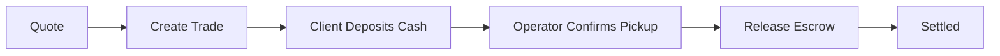

The Exchange Kit gives operators everything they need to run an OTC crypto exchange. Clients request quotes, operators fulfill trades, and funds move through an escrow-backed settlement flow.

## Core Concepts

### Quotes

A quote is a price commitment for a specific trade: currency pair, direction (buy/sell), and amount. Quotes reflect the current market rate plus your configured spread.

```
GET /v1/exchange/quote?fromCurrency=USD&toCurrency=ETH&amount=1000
```

Quotes are point-in-time — they expire after a short window. Use them to present a rate to your client before initiating a trade.

### Spread

Spread is the margin you capture on each trade — the difference between the market rate and the rate you offer your client. You configure a spread percentage per operator account.

- **Buy spread** — applied when your client buys crypto
- **Sell spread** — applied when your client sells crypto

Spread is configured once via `PATCH /v1/exchange/operator/spread` and applies to all subsequent quotes.

### Trades

A trade is a fulfilled quote. When a client accepts a quote, you create a trade. The trade lifecycle is:



1. **Created** — trade initiated with an accepted quote
2. **Deposit pending** — waiting for client to deliver cash (for buy trades)
3. **Picked up** — operator confirms physical cash receipt
4. **Released** — operator releases crypto from escrow to client
5. **Settled** — trade complete

### Settlement

Settlement happens in two steps for a crypto-for-cash trade:

1. Operator receives cash from the client and calls `PATCH /v1/exchange/trades/{id}/pickup`
2. Operator releases crypto from escrow to the client's wallet by calling `POST /v1/exchange/trades/{id}/release`

Crypto is held in a Signing Kit escrow wallet between steps 1 and 2.

### Cash Management

The treasury tracks your physical cash position alongside your crypto holdings. Log cash deposits and withdrawals as entries so your dashboard summary stays accurate.

### Client Management

Clients are the end-users or counterparties you trade with. The Exchange Kit maintains a client registry accessible via `GET /v1/exchange/clients`. Clients are typically onboarded through your KYB flow before they can trade.

## Endpoint Summary

| Group | Endpoints | Purpose |
|-------|-----------|---------|
| Quotes | `GET /v1/exchange/quote` | Price a trade |
| Trades | `POST /v1/exchange/trades`, `GET /v1/exchange/trades/{id}` | Create and track trades |
| Settlement | `PATCH /v1/exchange/trades/{id}/pickup`, `POST /v1/exchange/trades/{id}/release` | Move through trade lifecycle |
| Clients | `GET /v1/exchange/clients` | View registered clients |
| Spread | `PATCH /v1/exchange/operator/spread` | Configure your margin |
| Treasury | `GET /v1/exchange/treasury`, `POST /v1/exchange/treasury/cash-entry` | Track cash position |
| Activation | `POST /v1/exchange/activate` | Register as OTC operator |

## Next Steps

<CardGroup cols={2}>
  <Card title="Flow Guide" icon="route" href="/exchange/flow-guide">
    Execute an end-to-end OTC trade step by step.
  </Card>
  <Card title="Endpoints" icon="code" href="/exchange/endpoints">
    Configure spread, clients, and cash management.
  </Card>
</CardGroup>
