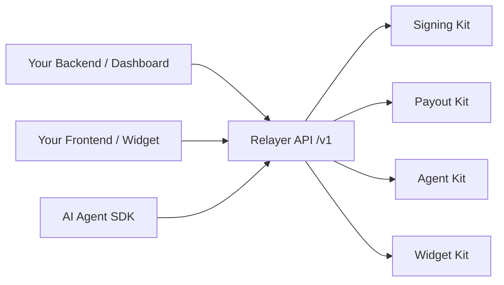

Relayer is the financial platform for **stablecoin operators today, and the AI agents they'll deploy tomorrow**. Both layers run on the same self-custodial backend, with the same wallet workspaces, the same compliance, and the same budget enforcement.

## The two layers

### Today — stablecoin operators

If your business moves money in stablecoins — OTC desks, payroll, B2B remittance, treasury, payment processors — you need a backend that gives you:

- **Self-custodial wallets** with passkey-based signing, so you never hold raw private keys and your users sign every transaction with biometrics
- **Regulated fiat rails** with virtual accounts (CLABE/SPEI in Mexico, ACH in the US, more coming), KYB built in, recipient onboarding handled
- **A workspace** where your team has individual passkeys, signing policies, approval thresholds, and full audit trail

This is what the [Signing Kit](/signing/overview) and [Payout Kit](/payout/overview) deliver. You can ship a compliant stablecoin product without writing a single line of custody, KYB, or compliance glue.

### Tomorrow — AI agents that hold wallets

Your team will eventually deploy AI agents alongside human operators. Those agents will need to spend money — LLM tokens, third-party APIs, on-chain payments, x402-gated resources — and they'll need a wallet to do it from.

The hard problem is **budget control**: how do you let an LLM-driven agent transact autonomously without risking a runaway spend? The [Agent Kit](/agent/overview) solves it with three layers of budget enforcement (infrastructure, tokens, payments) plus a kill switch, all enforced atomically server-side. **If the SDK says "no budget", the payment does not happen.** No prompt-injection escape, no model-side override.

The agent's wallet is the same primitive as your team's wallet. The signing policy that protects your CFO's wallet also protects your agent's. The approval flow that gates your operations team's high-value transactions also gates the agent's. **One platform, two operators: humans and machines.**

## Shared primitives

What makes both layers work on the same backend:

| Primitive | Used by humans for | Used by agents for |
|---|---|---|
| **Wallet workspace** | Team's funds, with team passkeys | Agent's funds, with HMAC-signed runtime auth |
| **Signing policies** | Restrict where the team can send | Restrict where the agent can send |
| **Approvals** | CFO signs off on high-value transfers | CFO signs off on agent's threshold spends |
| **Budgets** | Per-wallet caps | Per-agent caps across 3 layers |
| **Orders** | Track every fiat settlement | Track every x402 payment |
| **Audit log** | Compliance and review | Same compliance and review |

## Kit architecture

You only integrate the Kits you need. They share authentication, workspace, and audit infrastructure underneath.



<CardGroup cols={2}>
  <Card title="Signing Kit" icon="key" href="/signing/overview">
    Self-custodial wallets, prepare/confirm signing, passkeys, recovery, policies, approvals.
  </Card>
  <Card title="Payout Kit" icon="money-bill-transfer" href="/payout/overview">
    Fiat on/off-ramp rails, virtual accounts, recipient management, and unified orders.
  </Card>
  <Card title="Agent Kit" icon="robot" href="/agent/overview">
    Budget-enforced AI agents with USDC wallets, signing, and x402 payments.
  </Card>
  <Card title="Widget Kit" icon="puzzle-piece" href="/widget/overview">
    Embeddable React components for canonical protocols (swap, transfer, crosschain).
  </Card>
</CardGroup>

## API design

All endpoints follow consistent patterns:

- **REST + JSON** — standard HTTP methods and JSON request/response bodies
- **Versioned** — all endpoints are prefixed with `/v1`
- **Consistent envelope** — every response uses the same structure:

```json
{
  "success": true,
  "message": "Success",
  "data": { },
  "statusCode": 200,
  "timestamp": "2026-03-28T12:00:00.000Z",
  "path": "/v1/signing/wallets"
}
```

- **Three auth modes** — `Authorization: ApiKey <key>` for backend integrations, `Authorization: Bearer <jwt>` for browser callers from the dashboard, and `X-Agent-Auth: <hmac>` for runtime calls from the agent SDK. See [Authentication](/get-started/authentication) for the full matrix.

## Next Steps

<CardGroup cols={2}>
  <Card title="Authentication" icon="lock" href="/get-started/authentication">
    Set up your API key, understand the three auth modes, and learn about environments.
  </Card>
  <Card title="Quickstart" icon="rocket" href="/get-started/quickstart">
    Make your first API call in under 5 minutes.
  </Card>
</CardGroup>
