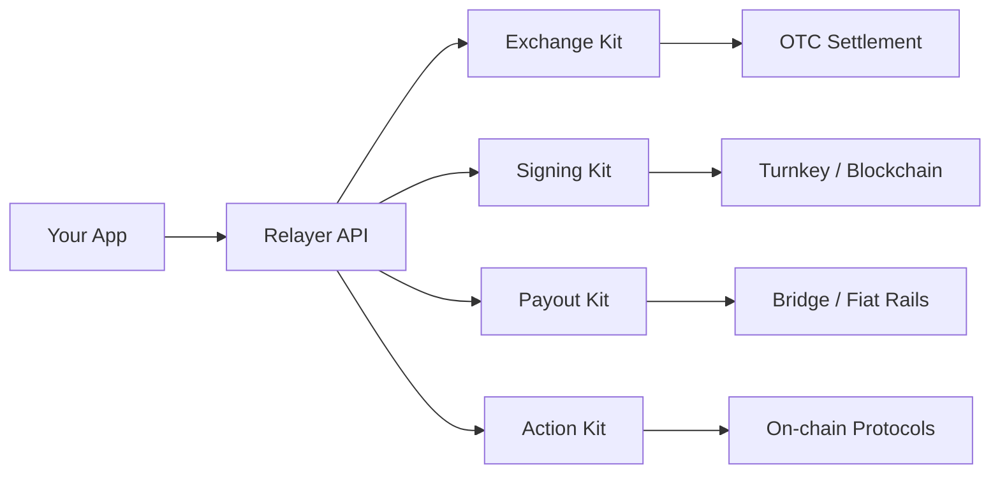

Relayer is a crypto B2B infrastructure platform that gives operators everything they need to build compliant financial products. Instead of stitching together dozens of services, you integrate one API organized into purpose-built **Kits**.

## Kit Architecture

Each Kit covers a distinct domain. You only integrate the Kits you need.

<CardGroup cols={2}>
  <Card title="Exchange Kit" icon="arrows-rotate" href="/exchange/overview">
    OTC exchange infrastructure -- quotes, spread management, client onboarding, and settlement.
  </Card>
  <Card title="Signing Kit" icon="key" href="/signing/overview">
    Wallet creation, escrow accounts, and transaction signing powered by Turnkey.
  </Card>
  <Card title="Payout Kit" icon="money-bill-transfer" href="/payout/overview">
    Fiat on/off-ramp rails via Bridge, recipient management, and settlement tracking.
  </Card>
  <Card title="Action Kit" icon="bolt" href="/action/overview">
    Blockchain action registry, transaction builders, token lists, and on-chain event indexing.
  </Card>
  <Card title="Widget Kit" icon="puzzle-piece" href="/widget/overview">
    Pre-built React components for embedding Relayer functionality in your frontend.
  </Card>
</CardGroup>

## How It Works

Your application talks to the Relayer API. The API routes requests to the appropriate Kit, which handles the domain-specific logic and communicates with the underlying infrastructure.



## API Design

All endpoints follow consistent patterns:

- **REST + JSON** -- standard HTTP methods and JSON request/response bodies
- **Versioned** -- all endpoints are prefixed with `/v1`
- **Consistent envelope** -- every response uses the same structure:

```json
{
  "success": true,
  "message": "Success",
  "data": { },
  "statusCode": 200,
  "timestamp": "2026-03-28T12:00:00.000Z",
  "path": "/v1/exchange/quotes"
}
```

- **API key auth** -- authenticate with an `Authorization: ApiKey <key>` header

## Next Steps

<CardGroup cols={2}>
  <Card title="Authentication" icon="lock" href="/get-started/authentication">
    Set up your API key and learn about environments.
  </Card>
  <Card title="Quickstart" icon="rocket" href="/get-started/quickstart">
    Make your first API call in under 5 minutes.
  </Card>
</CardGroup>
