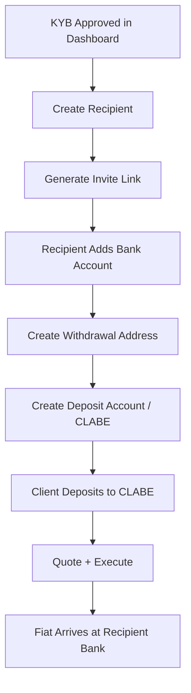

The Payout Kit gives operators regulated fiat rails for moving money between stablecoins and bank accounts. Clients deposit stablecoins to a deposit account and receive fiat at the recipient bank — or deposit fiat and receive stablecoins at a withdrawal address. You manage the full cycle: business onboarding, recipient configuration, account setup, and settlement execution.

## Core Concepts

### Off-ramp and On-ramp

Two directions, same primitives:

- **Off-ramp** — stablecoins in, fiat out. Money flows from a withdrawal address to a recipient's bank account.
- **On-ramp** — fiat in, stablecoins out. Money flows from a deposit account (e.g. a CLABE) to a stablecoin wallet.

Both flows use quote → setup → execute as the canonical lifecycle.

### Business Onboarding (KYB)

Before sending or receiving fiat, your workspace must complete KYB. KYB is a one-time setup managed through the Dashboard. Once approved, your workspace can create deposit accounts, withdrawal addresses, and process transfers.

### Recipients (Beneficiaries)

A **recipient** (beneficiary) is the person or business you want to pay — identified by name, address, and one or more bank accounts. Recipients are managed under `/v1/payout/recipients`.

Recipient lifecycle:

1. Create the recipient record (name, address, owner type)
2. Generate an invite link — the recipient submits their bank details via a hosted form
3. Add the bank account to the recipient (registered with the fiat rails partner)
4. Recipient is ready to receive payouts

### Withdrawal Addresses (Off-ramp)

A **withdrawal address** is a crypto address linked to a recipient's bank account. When stablecoins are sent to this address, the off-ramp transfer to the linked bank is initiated automatically.

```
POST /v1/payout/offramp/withdraw-addresses
```

The call is idempotent.

### Deposit Accounts (On-ramp)

A **deposit account** is a permanent fiat account (e.g. a SPEI CLABE in Mexico) tied to a stablecoin wallet. Your client sends fiat to this account and the funds settle to the linked wallet.

```
POST /v1/payout/onramp/deposit-accounts
```

The call is idempotent.

### Quotes and Settlement

Before executing a transfer, get a quote to see the rate and fees. Then execute to trigger the actual transfer.

```
POST /v1/payout/offramp/quote      — Get stablecoin → fiat rate
POST /v1/payout/onramp/quote       — Get fiat → stablecoin rate
POST /v1/payout/accounts/quote     — Get cross-currency rate (e.g. MXN → USD)
POST /v1/payout/accounts/execute   — Trigger settlement
```

### Orders

Every transfer is represented as an **order** in `/v1/orders`. Unified across rails — list, get, and cancel are the same regardless of direction.

## Endpoint Summary

| Group | Prefix | Purpose |
|-------|--------|---------|
| Accounts | `/v1/payout/accounts` | Cross-currency quotes and payment execution |
| On-ramp | `/v1/payout/onramp` | Fiat → stablecoin: deposit accounts, quotes |
| Off-ramp | `/v1/payout/offramp` | Stablecoin → fiat: withdrawal addresses, quotes |
| Recipients | `/v1/payout/recipients` | Beneficiary CRUD and bank account registration |
| Orders | `/v1/orders` | Unified order list, status, and cancel |

## Integration Overview



## Next Steps

<CardGroup cols={2}>
  <Card title="Flow Guide" icon="route" href="/payout/flow-guide">
    Execute an end-to-end payout step by step.
  </Card>
  <Card title="Endpoints" icon="code" href="/payout/endpoints">
    Accounts, on/off-ramp, and recipient endpoint reference.
  </Card>
</CardGroup>
