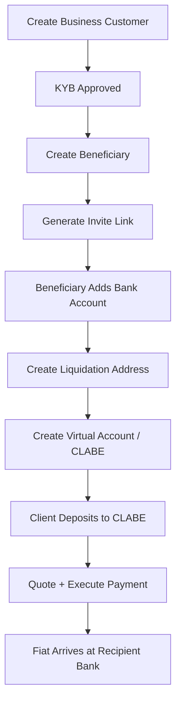

The Payout Kit gives operators fiat off-ramp infrastructure built on [Bridge](https://bridge.xyz). Clients deposit stablecoins to a virtual account and receive fiat to their bank. You manage the full cycle: KYB onboarding, recipient configuration, account setup, and settlement execution.

## Core Concepts

### Payout Rails

Payout rails are the underlying fiat transfer infrastructure provided by Bridge. Relayer wraps Bridge's KYB, virtual account, external account, and transfer APIs so you manage everything from a single API key.

The primary rails flow:

```
Stablecoin deposit → Liquidation address → Off-ramp → Recipient bank account
```

### Business Customers (KYB)

Before sending or receiving fiat, your operator account must complete KYB (Know Your Business) through Bridge. You create a **business customer** record — this is the Bridge-side entity representing your operation.

```
POST /v1/payout/rails/business-customers
```

KYB is a one-time setup. Once approved, your operator account can create virtual accounts and process transfers.

### Beneficiaries (Recipients)

A **beneficiary** is a recipient you want to pay — a person or business with a bank account. Beneficiaries are stored in Relayer's database (no Bridge call at creation). You then invite them to submit their bank details, which get registered with Bridge.

Beneficiary lifecycle:
1. Create the beneficiary record (name, address, owner type)
2. Generate an invite link — beneficiary submits their bank details via a hosted form
3. Add the bank account to the beneficiary record (registered with Bridge)
4. Beneficiary is ready to receive payouts

### Liquidation Addresses

A **liquidation address** is a crypto chain address linked to a beneficiary's bank account. When stablecoins are sent to this address, Bridge automatically initiates the off-ramp transfer to the linked bank.

```
POST /v1/payout/accounts/setup/liquidation-address
```

This is Step 1 of the two-step account setup. It links a beneficiary's external bank account to a specific chain for off-ramp. The call is idempotent.

### Virtual Accounts (SPEI/CLABE)

A **virtual account** is a permanent MXN SPEI account with a CLABE number. Your client sends fiat to this CLABE and the funds flow through the liquidation address to the beneficiary's bank.

```
POST /v1/payout/accounts/setup/virtual-account
```

This is Step 2 of account setup. Requires a liquidation address to exist first. Returns the CLABE your client uses for deposits. The call is idempotent.

### Payment Quotes & Settlement

Before executing a payment, get a quote to see the rate and fees for a given amount. Then execute the payment to trigger the actual off-ramp transfer.

```
POST /v1/payout/accounts/quote    — Get rate + fees
POST /v1/payout/accounts/execute  — Trigger settlement
```

## Endpoint Summary

| Group | Prefix | Purpose |
|-------|--------|---------|
| Rails | `/v1/payout/rails` | Business customer KYB, Bridge transfers |
| Accounts | `/v1/payout/accounts` | Liquidation addresses, virtual accounts, payments |
| Recipients | `/v1/payout/recipients` | Beneficiary CRUD, bank account registration |

## Integration Overview



## Next Steps

<CardGroup cols={2}>
  <Card title="Flow Guide" icon="route" href="/payout/flow-guide">
    Execute an end-to-end payout step by step.
  </Card>
  <Card title="Endpoints" icon="code" href="/payout/endpoints">
    Rails, accounts, and recipient endpoint reference.
  </Card>
</CardGroup>
