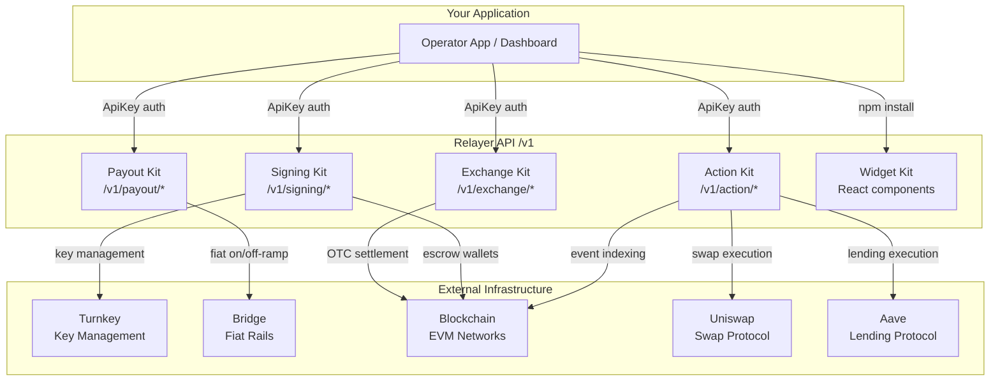
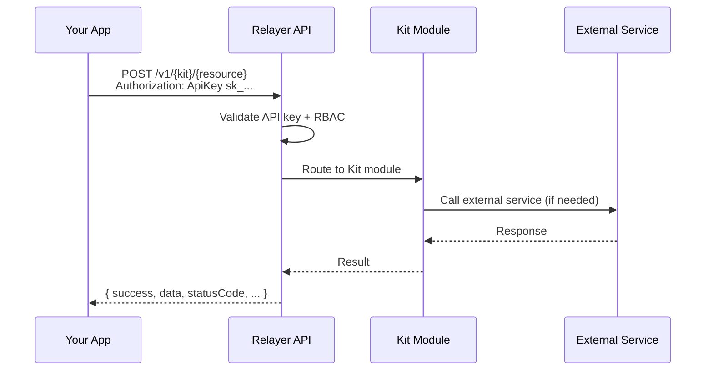

Relayer is organized into Kits. Each Kit covers a distinct domain and exposes a set of REST endpoints under a versioned prefix. This page shows how the Kits relate to each other and to the external infrastructure they depend on.

## Kit Structure



## Kit Responsibilities

| Kit | Prefix | What It Does |
|-----|--------|-------------|
| **Exchange** | `/v1/exchange` | OTC quotes, spread configuration, client management, settlement |
| **Signing** | `/v1/signing` | Wallet creation, escrow accounts, transaction signing, key policy |
| **Payout** | `/v1/payout` | Payout rail setup, recipient management, settlement tracking |
| **Action** | `/v1/action` | Mini-app registry, transaction builders, token lists, on-chain indexing |
| **Widget** | npm package | Pre-built React components that wrap Kit API calls |

## Request Flow

Every API request follows the same pattern:



## Authentication Model

All requests authenticate with an operator API key in the `Authorization` header:

```
Authorization: ApiKey sk_client_key_v1_your_key_here
```

The API key identifies the operator and determines which Kits and resources are accessible based on the operator's module configuration and team role permissions (v2.0+).

## Environments

| Environment | Base URL | Use |
|-------------|----------|-----|
| Sandbox | `https://relayer-api.onrender.com` | Development and testing |
| Production | `https://api.relayer.fi` | Live operations |

All Kit endpoints and authentication patterns are identical across environments.
