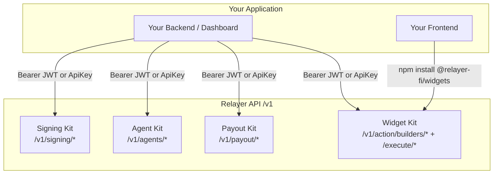
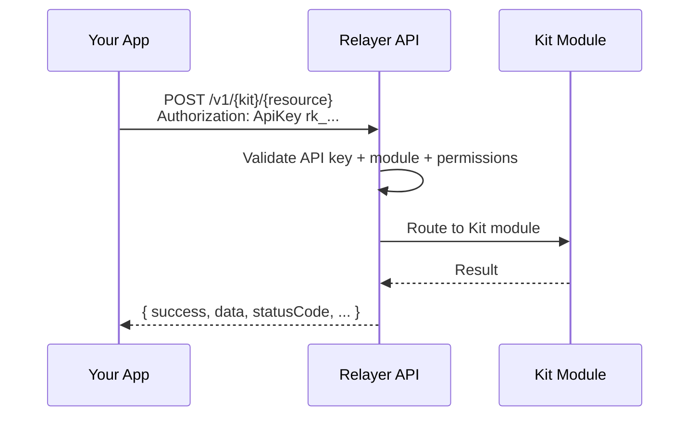

Relayer is organized into Kits. Each Kit covers a distinct domain and exposes a set of REST endpoints under the `/v1` prefix. This page shows how the Kits relate to each other and to your application.

## Kit Structure



## Kit Responsibilities

| Kit | Prefix | What It Does |
|-----|--------|-------------|
| **Signing** | `/v1/signing`, `/v1/transactions` | Self-custodial wallets, transaction prepare/confirm, passkey signing, approval policies |
| **Agent Kit** | `/v1/agents` | Budget-enforced AI agents that can sign transactions and pay for x402 resources |
| **Payout** | `/v1/payout`, `/v1/orders` | Fiat on/off-ramp, recipient management, virtual accounts, payment settlement |
| **Widget Kit** | `/v1/action/builders`, `/v1/action/execute`, npm packages | Embeddable widgets for canonical protocols (swap, transfer, bridge) |

## Request Flow

Every API request follows the same pattern:



## Authentication Model

Every request authenticates with an API key in the `Authorization` header:

```
Authorization: ApiKey rk_client_key_v1_your_key_here
```

The API key identifies the integrator (your workspace) and determines which Kits and resources are accessible based on the workspace's active modules and the caller's role.

Some surfaces also accept a session JWT (`Authorization: Bearer <jwt>`) for browser-side callers from the Relayer dashboard, and the Agent Kit accepts an HMAC-signed `X-Agent-Auth` header for runtime calls from the agent SDK. See [Authentication](/get-started/authentication) for the full matrix.

## Environments

| Environment | Base URL | Use |
|-------------|----------|-----|
| Sandbox | `https://testnet.relayer.fi/v1` | Development and testing |
| Production | `https://api.relayer.fi/v1` | Live operations |

All Kit endpoints and authentication patterns are identical across environments.
