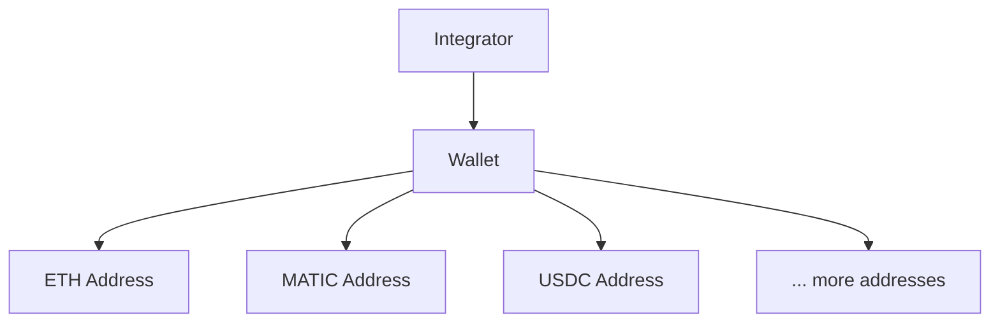

<Warning>
  The Signing Kit manages cryptographic private keys and submits transactions to live blockchain networks. Signed transactions and broadcasts are irreversible. Always verify destination addresses and amounts before signing or broadcasting.
</Warning>

The Signing Kit gives operators secure wallet infrastructure backed by [Turnkey](https://turnkey.com) — a key management service that stores private keys in hardware-secured enclaves. You create wallets, generate addresses, set signing policies, and sign or broadcast transactions — all without handling raw private keys.

## Core Concepts

### Wallets and Addresses

A **wallet** in the Signing Kit maps to a Turnkey sub-organization. Each wallet can generate multiple addresses across different networks (Ethereum, Polygon, etc.).

- One wallet → multiple addresses
- Addresses are deterministically derived (HD wallet)
- Network is specified per address

### Escrow Wallets

An escrow wallet is a Signing Kit wallet used to temporarily hold funds during an OTC trade or payout flow. The Exchange Kit automatically uses escrow wallets between when cash is received and when crypto is released.

From the Signing Kit's perspective, an escrow wallet is an ordinary wallet — you create it, generate an address, and the Exchange Kit handles the lifecycle.

### Transaction Signing

The Signing Kit separates two concerns:

1. **Signing** — creates a signed transaction payload (`/transactions/sign/*`)
2. **Broadcasting** — submits the signed payload to the network (`/transactions/broadcast/*`)

You can sign a transaction without broadcasting it immediately. This is useful for multi-step approval flows.

**Supported transaction types:**
- Native token transfers (ETH, MATIC, BNB, etc.) via `/transactions/sign/transfer/native`
- ERC20 token transfers via `/transactions/sign/transfer/token`
- Generic transactions (custom calldata) via `/transactions/sign`

### Signing Policies

A signing policy is a set of rules attached to a wallet or integrator that controls which transactions Turnkey will sign. Policies can restrict:

- **Value limits** — maximum transaction value in USD or token amount
- **Destination addresses** — allowlist or denylist of recipient addresses
- **Token types** — which tokens are permitted to transfer
- **Time windows** — signing only allowed during certain hours

Policies are enforced at the Turnkey level, before the transaction reaches the blockchain.

### Approval Flows

For high-value or sensitive operations, you can require human approval before a transaction is signed. Configure an approval threshold via `/v1/signing/approval-config`. Transactions above the threshold enter a pending approval queue (`/v1/signing/approvals`) where an authorized team member must approve or reject.

### Integrators

An integrator is a sub-account within your operator that can have its own wallets, API keys, and signing policies. Use integrators to isolate wallets per client, product line, or environment.

## Endpoint Summary

| Group | Endpoints | Purpose |
|-------|-----------|---------|
| Wallets | `POST /v1/wallets`, `GET /v1/wallets/{id}` | Create and manage wallets |
| Addresses | `POST /v1/wallets/{id}/addresses` | Generate wallet addresses |
| Sign | `POST /v1/transactions/sign/transfer/native` | Sign transactions |
| Broadcast | `POST /v1/transactions/broadcast/{id}` | Submit to blockchain |
| Policies | `POST /v1/signing/policies` | Restrict signing rules |
| Approvals | `GET /v1/signing/approvals` | Review pending approvals |
| Integrators | `POST /v1/integrators` | Create isolated sub-accounts |

## Security Model

- Private keys are stored in Turnkey hardware-secured enclaves — Relayer never has access to raw keys
- All signing requests are authenticated with your API key
- Signing policies provide a second layer of control independent of API authentication
- Approval flows add a human-in-the-loop gate for sensitive operations

## Next Steps

<CardGroup cols={2}>
  <Card title="Flow Guide" icon="route" href="/signing/flow-guide">
    Create a wallet and sign your first transaction.
  </Card>
  <Card title="Endpoints" icon="code" href="/signing/endpoints">
    Configure signing policies, approvals, and integrators.
  </Card>
</CardGroup>
