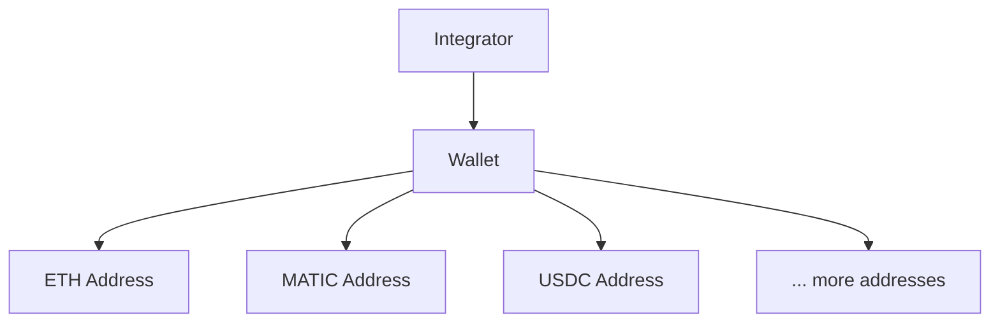

<Warning>
  The Signing Kit manages cryptographic private keys and submits transactions to live blockchain networks. Signed transactions and broadcasts are irreversible. Always verify destination addresses and amounts before signing or broadcasting.
</Warning>

The Signing Kit gives operators a self-custodial wallet stack with passkey-based signing. You create wallets, generate addresses, set signing policies, and sign or broadcast transactions — **Relayer never holds or has access to your raw private keys**. Signing happens inside a hardware-secured enclave, gated by a passkey biometric prompt on the user's device.

## Core Concepts

### Wallets and Addresses

A **wallet** is the root container for a set of derived addresses. Each wallet can generate multiple addresses across different networks (Ethereum, Polygon, Solana, etc.).

- One wallet → multiple addresses
- Addresses are deterministically derived (HD wallet)
- Network is specified per address

### Prepare / Confirm Signing

Signing is a two-step flow so the private key material never has to leave the secure enclave:

1. **Prepare** — `POST /v1/transactions/prepare` returns an unsigned transaction payload
2. **Confirm** — the user stamps it with their passkey, then `POST /v1/transactions/confirm` validates the stamped activity and signs

You can sign without broadcasting immediately. Broadcasting is a separate step (`POST /v1/transactions/broadcast/{id}`) so multi-step approval flows can gate the final submission.

### Signing Policies

A signing policy is a set of rules attached to a wallet or workspace that controls which transactions can be signed. Policies can restrict:

- **Value limits** — maximum transaction value in USD or token amount
- **Destination addresses** — allowlist or denylist of recipients
- **Token types** — which tokens are permitted to transfer
- **Time windows** — signing only allowed during certain hours

Policies are enforced **before** the signing enclave processes the transaction. A transaction that violates policy never gets signed.

### Approval Flows

For high-value or sensitive operations, you can require human approval before a transaction is signed. Configure an approval threshold via `PATCH /v1/signing/approval-config`. Transactions above the threshold enter a pending approval queue (`GET /v1/signing/approvals`) where an authorized team member stamps approval with their passkey (`POST /v1/signing/approvals/{id}/approve-with-passkey`).

### Recovery

If a user loses access to their passkey, the Signing Kit supports an email-based recovery flow (`POST /v1/signing/recovery/initiate`). Recovery re-binds a new passkey to the existing wallet without rotating the underlying keys.

## Endpoint Summary

| Group | Endpoints | Purpose |
|-------|-----------|---------|
| Wallets | `POST /v1/signing/wallets/prepare`, `POST /v1/signing/wallets/confirm` | Create wallets with passkey |
| Addresses | `POST /v1/signing/wallets/{id}/addresses` | Generate wallet addresses |
| Sign | `POST /v1/transactions/prepare`, `POST /v1/transactions/confirm` | Self-custodial signing flow |
| Broadcast | `POST /v1/transactions/broadcast/{id}` | Submit to blockchain |
| Passkeys | `POST /v1/signing/passkeys/register` | Enroll a passkey |
| Recovery | `POST /v1/signing/recovery/initiate` | Recover access via email |
| Policies | `POST /v1/signing/policies` | Restrict signing rules |
| Approvals | `GET /v1/signing/approvals` | Review pending approvals |

## Security Model

- Private keys live inside a hardware-secured enclave — neither Relayer nor the integrator ever sees raw key material
- Every signing operation is gated by a passkey biometric prompt on the user's device
- Signing policies provide a second layer of control independent of API authentication
- Approval flows add a human-in-the-loop gate for sensitive operations

## Next Steps

<CardGroup cols={2}>
  <Card title="Flow Guide" icon="route" href="/signing/flow-guide">
    Create a wallet and sign your first transaction.
  </Card>
  <Card title="Endpoints" icon="code" href="/signing/endpoints">
    Configure signing policies, approvals, and recovery.
  </Card>
</CardGroup>
