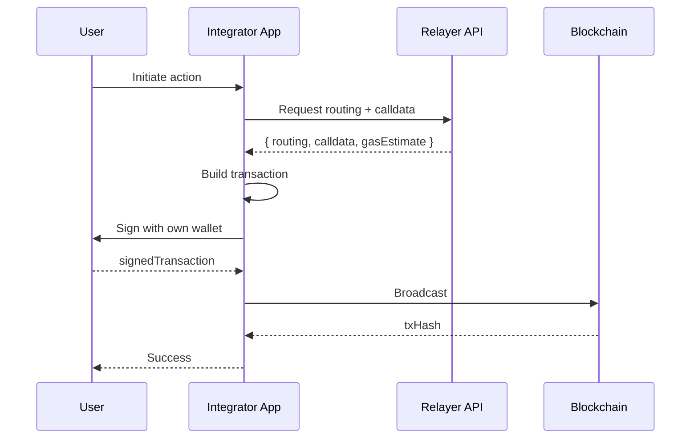

Widget Kit is a set of React components and adapters that let you embed blockchain interactions — swaps, transfers, cross-chain bridges — directly in React and Next.js apps. It is built on a self-custodial architecture: **Relayer never holds your private keys**. Transaction signing happens either through Relayer's hosted passkey flow or through your own wallet stack, depending on which integration mode you choose.

## Two Integration Modes

Widget Kit supports two integration modes. The mode is determined by your wallet stack, not the widget type — every widget works with both modes.

<Tabs>
  <Tab title="Passkey Signing">
    **For integrators using Relayer's managed wallet stack.**

    In Passkey Signing, each integrator gets a dedicated wallet workspace with passkey-based signing. The widget handles the full signing flow internally:

    1. Widget sends the transaction to the Relayer API for preparation
    2. User sees a biometric prompt (Face ID, fingerprint, security key)
    3. The secure enclave signs the transaction using the user's passkey
    4. Relayer API validates and broadcasts the signed transaction

    Each integrator has their own isolated wallet workspace. Team members have individual passkeys. Policies define approval rules.

    For **Embedder** integrators, each end user gets their own wallet and passkey — the widget guides them through passkey registration and signing.
  </Tab>
  <Tab title="Metadata Mode">
    **For integrators who bring their own wallet stack (MPC, HSM, MetaMask, WalletConnect, or any EVM-compatible signer).**

    In Metadata Mode, the widget requests routing and calldata from the Relayer API, then hands the transaction metadata back to your application:

    1. Widget sends the action to the Relayer API
    2. API returns routing, calldata, and gas estimates
    3. Your application builds the transaction from the returned calldata
    4. Your signer signs the transaction (MPC, HSM, browser wallet, etc.)
    5. Your application broadcasts to the blockchain

    No managed signing is involved. You control the entire signing and broadcast pipeline.
  </Tab>
</Tabs>

## Self-Custodial Architecture

<Warning>
Relayer never holds your private keys. All transaction signing happens either through Relayer's hosted passkey flow (Passkey Signing) or through your own wallet stack (Metadata Mode).
</Warning>

### Passkey Signing Flow

### Metadata Mode Flow

## Supported Protocols

Widget Kit ships with first-party widgets for the canonical protocols Relayer supports. Custom widget metadata is not user-uploadable — every widget surface comes from this curated set.

| Widget | What It Does |
|--------|-------------|
| **Swap** | Token-to-token swaps via smart routing |
| **Transfer** | Native and ERC20 token transfers |
| **Crosschain Transfer** | Transfer the same asset across networks |
| **Crosschain Bridge** | Bridge assets between supported chains |

<Note>
Each widget works with both Passkey Signing and Metadata Mode. The mode is determined by the integrator's configuration, not the widget type.
</Note>

## Package Ecosystem

The Widget Kit is composed of three core packages:

| Package | npm | Description | Audience |
|---------|-----|-------------|----------|
| **widget-kit-react** | `@relayerfi/widget-kit-react` | Main integration library. React components (`Widget`), wallet adapters, platform observers for Twitter/X, YouTube, and Twitch. | App developers embedding widgets |
| **widget-kit-core** | `@relayerfi/widget-kit-core` | Framework-agnostic runtime. Widget directory, metadata fetching, security classification. Consumed internally. | Internal — no direct install needed |
| **action-kit** | `@relayerfi/action-kit` | Shared type and validator contract used by widget-kit. Defines metadata schemas for the canonical protocols. | Internal — no direct install needed |

<Note>
You only install `@relayerfi/widget-kit-react` directly. The other two packages are peer dependencies bundled internally.
</Note>

## The Widget Component

`Widget` is the main embedding surface. It accepts a URL pointing to canonical action metadata (or a pre-validated metadata object) and renders an interactive widget card. The component handles metadata fetching, schema validation, wallet connection, and transaction signing automatically — you provide a URL and a wallet adapter, and the Widget does the rest.

In Passkey Signing, the Widget handles the passkey prompt automatically. In Metadata Mode, the Widget returns transaction metadata for the integrator to sign externally.

## Platform Observers

The package ships observers for automatic widget detection and rendering on Twitter/X, YouTube, and Twitch. These observers scan the DOM for canonical action URLs and render Widget components inline. A browser extension built on the same primitives is also available. For custom embedding in your own app, use the `Widget` component directly.

## Next Steps

<CardGroup cols={2}>
  <Card title="Installation" icon="download" href="/widget/installation">
    Install and configure the widget packages.
  </Card>
  <Card title="Integration Guide" icon="plug" href="/widget/integration">
    Embed and theme your first widget.
  </Card>
  <Card title="SDK Reference" icon="code" href="/widget/sdk">
    The metadata schema for canonical protocols.
  </Card>
</CardGroup>
