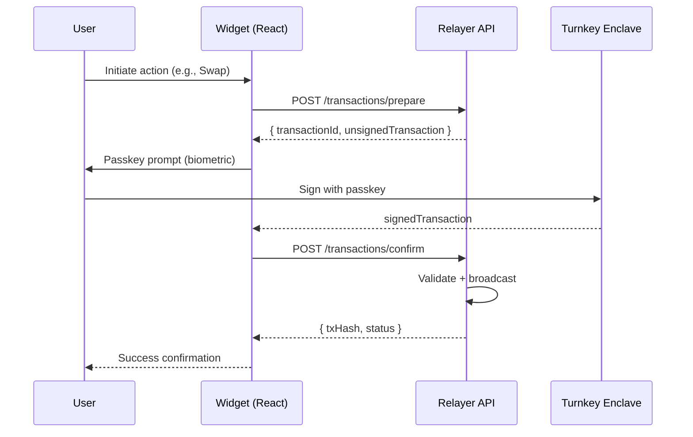
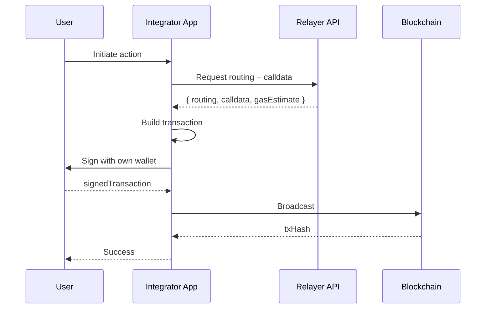

Widget Kit is a set of React components and adapters that let you embed blockchain interactions — swaps, lending, transfers, payments — directly in React and Next.js apps. It is built on a self-custodial architecture: **Relayer never holds your private keys**. Transaction signing happens either through Turnkey passkeys or your own wallet infrastructure, depending on which integration mode you choose.

## Two Integration Modes

Widget Kit supports two integration modes. The mode is determined by your wallet infrastructure, not the widget type — every widget works with both modes.

<Tabs>
  <Tab title="Turnkey Mode">
    **For integrators whose wallets live in Relayer's Turnkey infrastructure.**

    In Turnkey Mode, each integrator gets a dedicated Turnkey sub-organization with passkey-based signing. The widget handles the full signing flow internally:

    1. Widget sends the transaction to the Relayer API for preparation
    2. User sees a biometric prompt (Face ID, fingerprint, security key)
    3. The Turnkey enclave signs the transaction using the user's passkey
    4. Relayer API validates and broadcasts the signed transaction

    Each integrator has their own Turnkey sub-org with isolation at the infrastructure level. Team members have individual passkeys. Policies define approval rules.

    For **Embedder** integrators, each end user gets their own wallet and passkey — the widget guides them through passkey registration and signing.
  </Tab>
  <Tab title="Metadata Mode">
    **For integrators who bring their own wallet stack (MPC, HSM, MetaMask, WalletConnect, or any EVM-compatible signer).**

    In Metadata Mode, the widget requests routing and calldata from the Relayer API, then hands the transaction metadata back to your application:

    1. Widget sends the action to the Relayer API
    2. API returns routing, calldata, and gas estimates
    3. Your application builds the transaction from the returned calldata
    4. Your signer signs the transaction (MPC, HSM, browser wallet, etc.)
    5. Your application broadcasts to the blockchain

    No Turnkey infrastructure is involved. You control the entire signing and broadcast pipeline.
  </Tab>
</Tabs>

## Self-Custodial Architecture

<Warning>
Relayer never holds your private keys. All transaction signing happens either through Turnkey passkeys (Turnkey Mode) or your own wallet infrastructure (Metadata Mode).
</Warning>

### Turnkey Mode Flow

### Metadata Mode Flow

## Widget Types

| Widget | Protocol | What It Does |
|--------|----------|-------------|
| **Swap** | Uniswap V4 | Token-to-token swaps |
| **Earn (Yield)** | Aave | Deposit/withdraw lending positions |
| **Transfer** | Native | Native and ERC20 token transfers |
| **Payment** | Composite | Payment acceptance flows |

<Note>
Each widget works with both Turnkey Mode and Metadata Mode. The mode is determined by the integrator's configuration, not the widget type.
</Note>

## Package Ecosystem

The Widget Kit is composed of three core packages:

| Package | npm | Description | Audience |
|---------|-----|-------------|----------|
| **relayer-widgets** | `@relayer-fi/widgets` | Main integration library. React components (`Trigger`), wallet adapters (`createWagmiAdapter`), platform observers for Twitter/X, YouTube, and Twitch. | App developers embedding widgets |
| **relayer-widgets-core** | `@relayer-fi/widgets-core` | Internal foundation. Shared types, error handling, utility functions, and directory management. Consumed internally by `@relayer-fi/widgets`. | Internal — no direct install needed |
| **relayer-action-kit** | `@relayer-fi/action-kit` | Action SDK. Metadata validation, executors, and type definitions for building blockchain interactions. | Internal — no direct install needed |

<Note>
You only install `@relayer-fi/widgets` directly. The other two packages are peer dependencies bundled internally.
</Note>

## The Trigger Component

`Trigger` is the main embedding surface. It accepts a URL pointing to blockchain action metadata (or a pre-validated metadata object) and renders an interactive widget card. The component handles metadata fetching, schema validation, wallet connection, and transaction signing automatically — you provide a URL and a wallet adapter, and Trigger does the rest.

In Turnkey Mode, the Trigger handles the passkey signing prompt automatically. In Metadata Mode, the Trigger returns transaction metadata for the integrator to sign externally.

## Platform Observers

The package ships observers for automatic trigger detection and rendering on Twitter/X, YouTube, and Twitch. These observers scan the DOM for blockchain action URLs and render Trigger components inline. A browser extension built on the same primitives is also available. For custom embedding in your own app, use the `Trigger` component directly.

## Relayer SDK

Blockchain action metadata is defined and validated using `@sherrylinks/sdk`. The SDK provides TypeScript types, validation functions, and parameter templates for building the metadata objects that power Trigger components. See the [Relayer SDK reference](/widget/sdk) for details.

## Next Steps

<CardGroup cols={2}>
  <Card title="Installation" icon="download" href="/widget/installation">
    Install and configure the widget packages.
  </Card>
  <Card title="Integration Guide" icon="plug" href="/widget/integration">
    Embed and theme your first widget.
  </Card>
  <Card title="Relayer SDK" icon="code" href="/widget/sdk">
    Build blockchain action metadata with the SDK.
  </Card>
</CardGroup>
