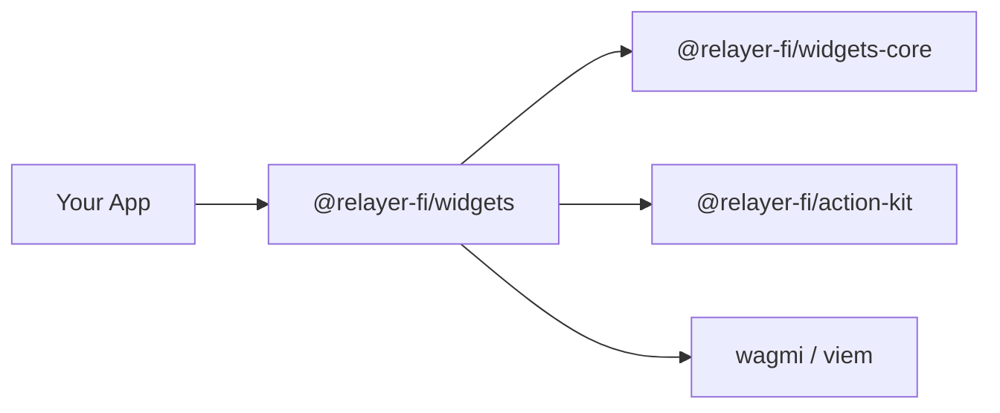

Widget Kit is a set of React components and adapters that let you embed blockchain interactions — swaps, transfers, staking — directly in web apps and any embedding platform. It handles wallet connection, transaction signing, theming, and metadata validation out of the box.

## Package Ecosystem

The Widget Kit is composed of three core packages:

| Package | npm | Description | Audience |
|---------|-----|-------------|----------|
| **relayer-widgets** | `@relayer-fi/widgets` | Main integration library. React components (`Trigger`), wallet adapters (`createWagmiAdapter`), platform observers for Twitter/X, YouTube, and Twitch. | App developers embedding widgets |
| **relayer-widgets-core** | `@relayer-fi/widgets-core` | Internal foundation. Shared types, error handling, utility functions, and directory management. Consumed internally by `@relayer-fi/widgets`. | Internal — no direct install needed |
| **relayer-action-kit** | `@relayer-fi/action-kit` | Action SDK. Metadata validation, executors, and type definitions for building blockchain interactions. | Internal — no direct install needed |

You only install `@relayer-fi/widgets` directly. The other two packages are peer dependencies bundled internally.

## How It Fits Together

Your app imports `@relayer-fi/widgets` and renders the `Trigger` component. Under the hood, `widgets` delegates to `widgets-core` for shared utilities and `action-kit` for metadata validation and transaction execution. Wallet connectivity is handled through wagmi and viem.

## The Trigger Component

`Trigger` is the main embedding surface. It accepts a URL pointing to blockchain action metadata (or a pre-validated metadata object) and renders an interactive widget card. The component handles metadata fetching, schema validation, wallet connection, and transaction signing automatically — you provide a URL and a wallet adapter, and Trigger does the rest.

## Platform Observers

The package ships observers for automatic trigger detection and rendering on Twitter/X, YouTube, and Twitch. These observers scan the DOM for blockchain action URLs and render Trigger components inline. A browser extension built on the same primitives is also available. For custom embedding in your own app, use the `Trigger` component directly.

## sherry-sdk

Blockchain action metadata is defined and validated using `@sherrylinks/sdk`. The SDK provides TypeScript types, validation functions, and parameter templates for building the metadata objects that power Trigger components. See the [sherry-sdk reference](/widget/sdk) for details.

## Next Steps

<CardGroup cols={2}>
  <Card title="Installation" icon="download" href="/widget/installation">
    Install and configure the widget packages.
  </Card>
  <Card title="Integration Guide" icon="plug" href="/widget/integration">
    Embed and theme your first widget.
  </Card>
  <Card title="sherry-sdk" icon="code" href="/widget/sdk">
    Build blockchain action metadata with the SDK.
  </Card>
</CardGroup>
